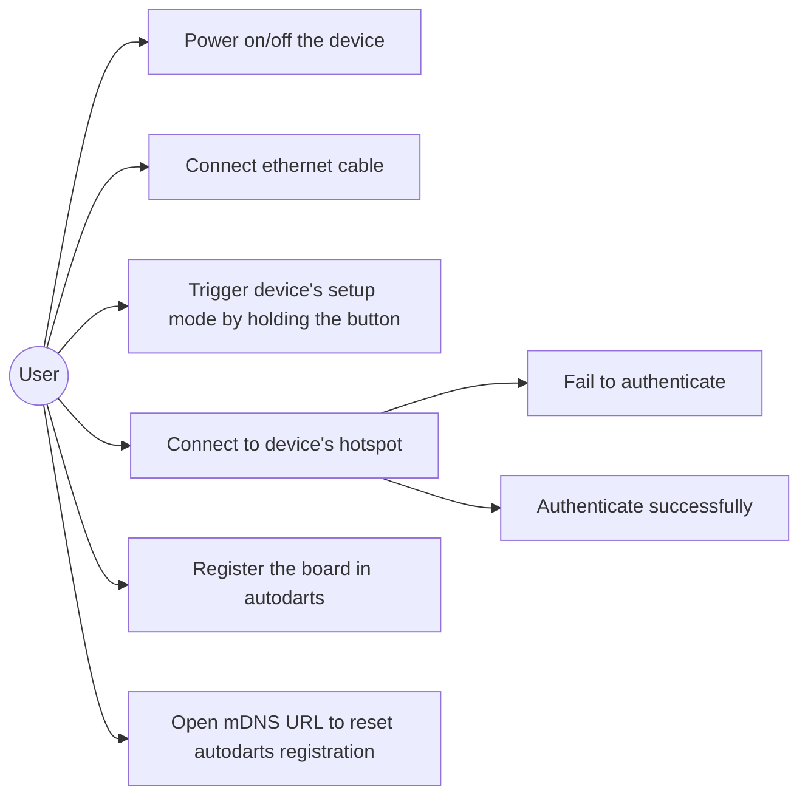
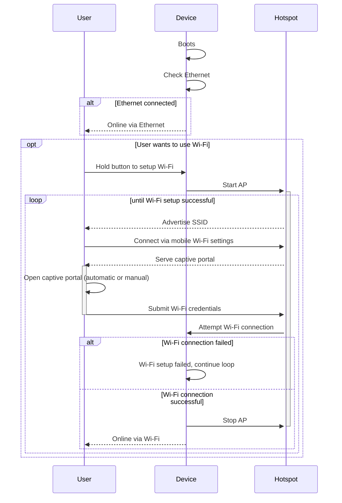
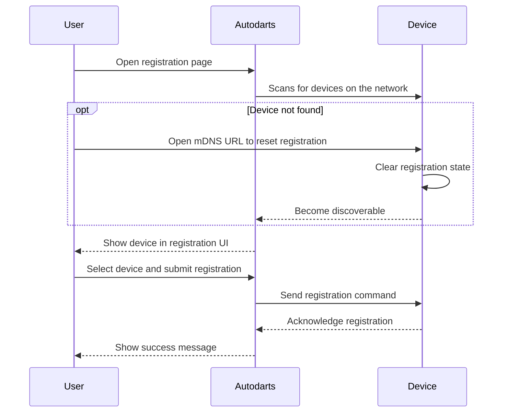
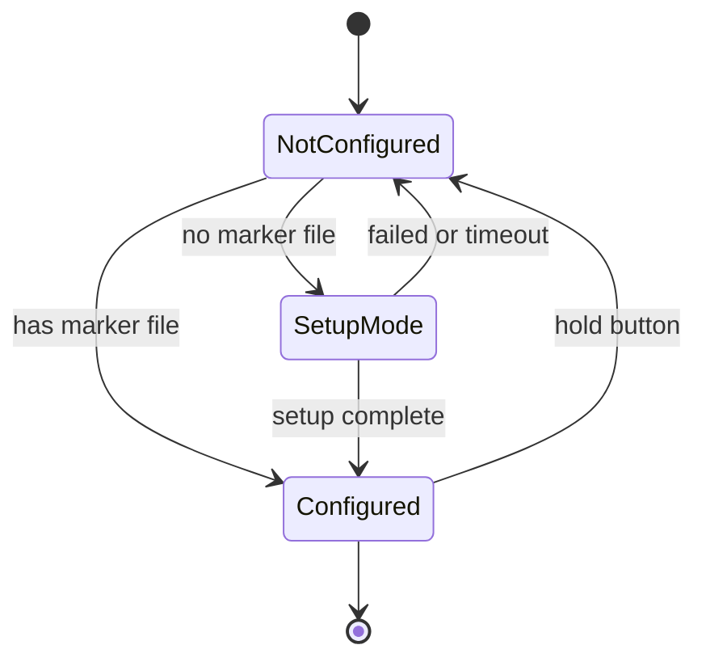
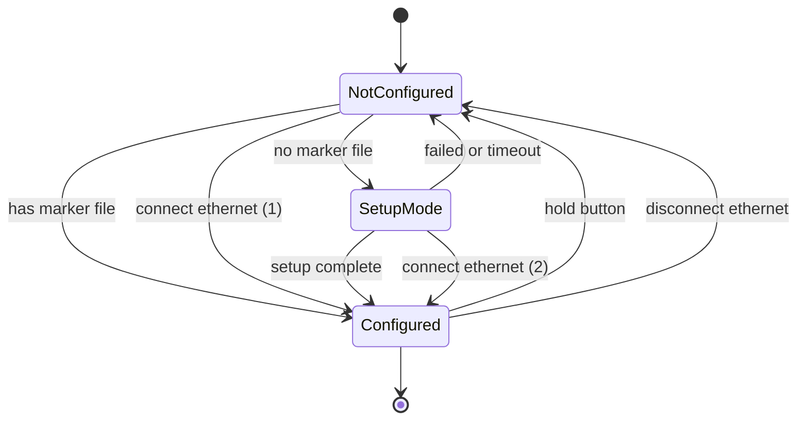
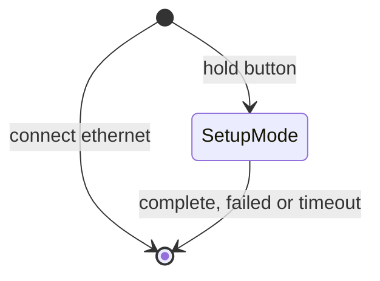

# US-01 Device setup

As a user,
I want to set up my new device without needing a screen or keyboard,
so that I can get it online and register it with the autodarts board.

## UCD-01: Device setup

## SD-01-US-01: Internet access setup

Preconditions:

- Device is powered on

---

## SD-02-US-01: Autodarts board registration

Preconditions:

- Device is powered on
- Device is online (via Ethernet or Wi-Fi)

---

## ST-01-US-01: Hotspot on boot no ethernet

From a user's perspective:

- doing nothing results in:
    1. captive portal showing up when NotConfigured
    2. nothing happening when Configured
- holding a button always results in captive portal showing up

> Doing nothing- inconsistent behavior.
>
> Holding button - consistent behavior.

From a system perspective:

- need to keep track of whether setup has been completed (marker file), so we don't ask user on every boot
- holding the button can happen indeterministically because it's a user action. Thus it needs an always-running event listener

## ST-02-US-01: Hotspot on boot with ethernet

From a user's perspective:

- doing nothing results in:
    1. captive portal showing up when NotConfigured and no ethernet
    2. nothing happening when NotConfigured and ethernet is connected
    3. nothing happening when Configured

- holding a button results in:
    1. captive portal showing up when no ethernet
    2. nothing happening when ethernet is connected.

- connecting ethernet results in:
    1. nothing happening when NotConfigured or Configured
    2. captive portal turning off when in SetupMode

> Doing nothing- inconsistent behavior
>
> Holding button - inconsistent behavior
>
> Connecting ethernet - inconsistent behavior

From a system perspective:

- need to keep track of whether setup has been completed (marker file), so we don't ask user on every boot
- holding the button can happen indeterministically because it's a user action. Thus it needs an always-running event listener
- ethernet can be connected/disconnected indeterministically because it's a user action. Thus it needs an always-running event listener

> Those two event listeners need to be coordinated such that if either of them triggers, the system transitions to the correct state (complexity)

## ST-03-US-01: Hotspot on button hold regardless of ethernet

From a user's perspective:

- doing nothing results always in nothing happening
- holding a button always results in captive portal showing up
- connecting ethernet always results in nothing happening

> Doing nothing- consistent behavior
>
> Holding button - consistent behavior
>
> Connecting ethernet - consistent behavior

From a system perspective:

- no internal state is needed to track setup completion, because we don't start at boot
- holding the button can happen indeterministically because it's a user action. Thus it needs an always-running event listener
- ethernet connectivity is managed by the OS and is independent of the wifi setup process

> No internal state simplifies the logic significantly, because we don't have to worry about coordinating between multiple event listeners and edge cases where they might conflict (e.g. user holds button while connecting ethernet)
> The wifi configuration state is managed by the OS, so subsequent boots will just work without needing to track whether setup has been completed or not
> This is the most intuitive from a user's perspective, because the button is a clear and consistent way to trigger setup mode regardless of the network state. It also avoids confusion around why the captive portal might not show up on boot if ethernet is connected.
